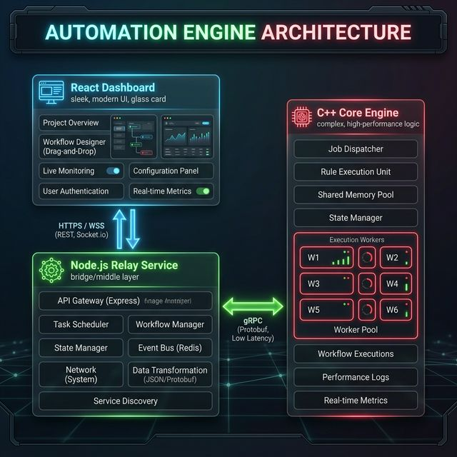

# System Architecture

The Automation Engine is a distributed system designed for high-performance task orchestration and security threat analysis.

## 🏗️ High-Level Design

The system follows a three-tier architecture:

1.  **Observability Layer (React Dashboard)**:
    - Provides real-time visibility into the engine's internal state.
    - Communicates via WebSockets for low-latency updates.

2.  **Communication Layer (Node.js Relay)**:
    - Decouples the frontend from the core engine.
    - Manages log streaming and client connections.

3.  **Execution Layer (C++ Automation Engine)**:
    - The core of the system.
    - Handles workflow parsing, task scheduling, and real-time security monitoring.

## 🔄 Data Flow

1.  **Workflow Definition**: Users define JSON routines in `shared/routine.json`.
2.  **Execution**: The Engine loads the routine, instantiates polymorphic workers, and executes them asynchronously.
3.  **Monitoring**: The `ThreatAnalyzer` listens on TCP port `9090`. If a malicious payload is detected, it triggers a `BlockIPTask` which interacts with the `Mock Rate Limiter` via HMAC-signed POST requests.
4.  **Logging**: All events are encrypted in `data/engine.log` using AES-256-GCM.
5.  **Visualization**: The Relay service tails the logs and broadcasts events to the Dashboard.
